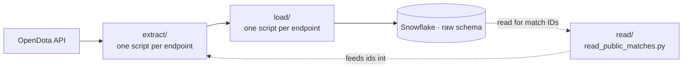

# Ingestion Architecture

How raw Dota 2 data gets from the OpenDota API into Snowflake, and why it's
built the way it is.

## Guiding principle: raw immutability

The ingestion layer has one job — **pull data and land it in Snowflake
exactly as received.** No cleaning, filtering, deduplication, or business
logic happens here; all of that is dbt's responsibility downstream. This
keeps the raw layer trustworthy: if a transformation turns out to be wrong,
it can always be rebuilt from source, because nothing was thrown away on
the way in.

## Data flow



## Folder structure

```
ingestion/
├── extract/   # Talks to the OpenDota API only — knows nothing about Snowflake
│   ├── utils/api_client.py   # shared get_data(base_url, api_key, endpoint)
│   └── get_data_*.py         # one thin wrapper per endpoint
├── read/      # Reads FROM Snowflake (queries, not loads)
│   └── read_public_matches.py
└── load/      # Writes TO Snowflake
    ├── dlt_loader.py         # shared load_to_snowflake(...)
    └── load_*.py             # one thin wrapper per endpoint
```

Each `extract`/`load` script is intentionally thin — all the actual HTTP and
Snowflake-loading logic lives once in `api_client.py` and `dlt_loader.py`.
Adding a new endpoint means writing a small wrapper, not new plumbing.

## Endpoints and write modes

| Data | Snowflake table | Write mode | Why |
|---|---|---|---|
| Heroes, constants | `raw.heroes`, `raw.constants_*` | `replace` | Small, slow-changing reference data — each run should just reflect "whatever the API says right now." |
| Public matches, match detail | `raw.public_matches`, `raw.matches` | `append` | Match data accumulates over time and must preserve history, including cases where the same match is re-fetched with different data later. |

## Constants: one endpoint, many resources

`/constants/{resource}` isn't one dataset — it's a family of small lookup
tables (`game_mode`, `lobby_type`, `region`, `items`, ...), all served by
the same OpenDota endpoint with a different `resource` name in the path.
Rather than writing a separate extract/load script per resource,
`get_data_constants(resource_name)` takes the resource name as a parameter,
and `load_constants.py` loops over an array of resource names
(`['game_mode', 'lobby_type', 'region', 'items']`), calling extract + load
once per resource so each one lands in its own table —
`raw.constants_game_mode`, `raw.constants_lobby_type`, and so on.

## The matches pipeline

This is the most complex part of the ingestion layer, so it's worth
explaining the reasoning.

**The problem:** `/publicMatches` only returns a random sample of ~100
recent matches per call — there's no way to query "matches since date X."
To get full detail for any match, each `match_id` needs its own call to
`/matches/{match_id}`.

**The approach:**
1. Each batch of matches pulled from `/publicMatches` is tracked in a
   control table, `raw.control_match_processing_status` — one row per match
   per batch, recording whether it's been successfully loaded into
   `raw.matches` yet. `read_public_matches.py` queries `raw.public_matches`
   joined against this control table and returns the rows that are still
   pending or previously failed, oldest batch first, capped per run.
2. For each of those rows, fetch `/matches/{match_id}` and load the result
   into `raw.matches`.
3. Mark the row `success` or `failed` back in the control table, so one
   failure never stops the rest of the batch.

**One API call, many tables:** `/matches/{match_id}` returns a large
nested payload, and dlt splits every nested list into its own child table
— `raw.matches__players`, `raw.matches__radiant_gold_adv`, plus roughly
two dozen more (teamfights, objectives, picks/bans, per-player logs for
gold/XP/purchases/wards/kills over time, etc.). Ingestion loads all of
them as-is, unfiltered, per the raw-immutability principle above — which
table gets carried into staging is a separate, later decision documented
in the [STTM](./sttm_raw_to_staging.md#9-match-detail-child-tables--scope-decision).

**The non-obvious design choice:** progress is tracked by dlt's row-level
`_dlt_id`, not by `match_id`. Since `raw.public_matches` is append-only, the
same `match_id` can appear multiple times across batches — tracking by
`_dlt_id` means each occurrence gets its own retry, so a match that comes
back incomplete (e.g. `duration: 0`, not yet parsed) will naturally get
re-fetched the next time it shows up, rather than being silently skipped
because "that `match_id` was already done."

## Status

Ingestion for heroes, constants, public matches, and match detail is built
and running. Orchestration (Airflow) is planned next.
